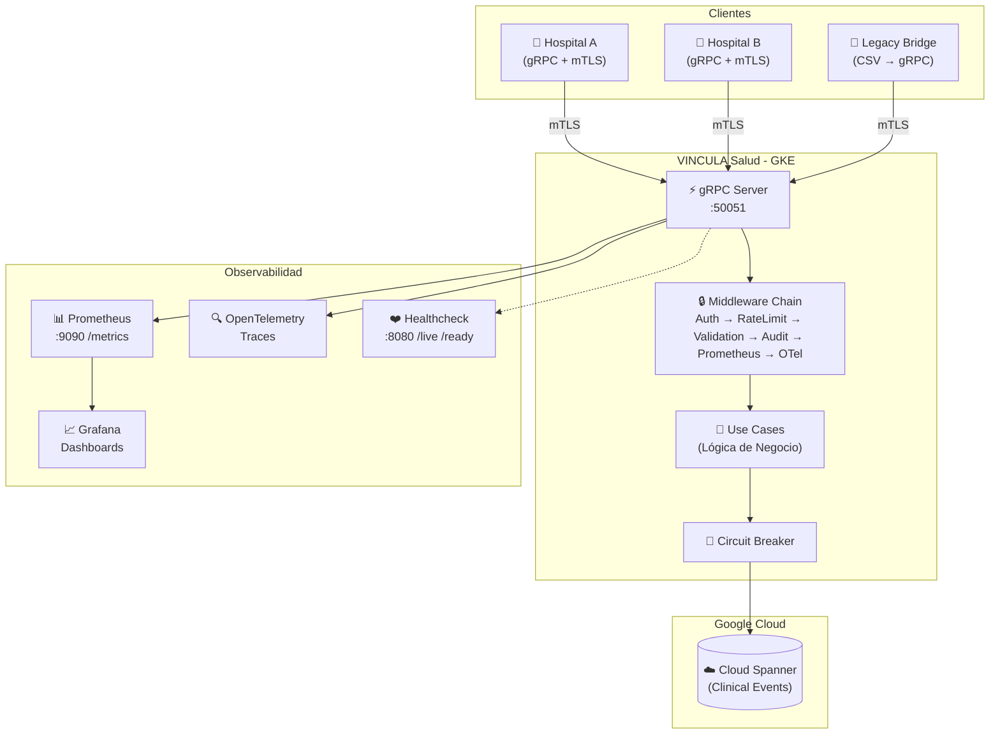

# 🏥 VINCULA Salud — Plataforma de Interoperabilidad Sanitaria

[](https://github.com/ciddiazIsaac/Vincula-Salud/actions/workflows/ci.yaml)
[](https://goreportcard.com/report/github.com/ciddiazIsaac/Vincula-Salud)
[](https://codecov.io/gh/ciddiazIsaac/Vincula-Salud)

**VINCULA Salud** es un servicio gRPC de alto rendimiento que permite a hospitales del sistema de salud pública de Chile compartir datos clínicos de pacientes de forma segura, estandarizada y en tiempo real. Actúa como el eje central de interoperabilidad: recibe eventos clínicos (diagnósticos, alergias, medicamentos), los persiste en Google Cloud Spanner, y expone resúmenes de historial consolidados a cualquier hospital autorizado de la red.

> **Estado:** Piloto técnico — No usar en producción sin revisión SRE.

---

## Tabla de Contenidos

- [Arquitectura](#arquitectura)
- [Stack Tecnológico](#stack-tecnológico)
- [Estructura del Proyecto](#estructura-del-proyecto)
- [Requisitos Previos](#requisitos-previos)
- [Ejecución Local](#ejecución-local)
- [API gRPC](#api-grpc)
- [Observabilidad](#observabilidad)
- [Testing](#testing)
- [Despliegue](#despliegue)
- [CI/CD](#cicd)

---

## Arquitectura



### Flujo de datos

1. Un hospital envía una petición gRPC autenticada con **mTLS** (TLS 1.3, certificado de cliente verificado).
2. La petición atraviesa la **cadena de interceptores**: autenticación, rate limiting, validación de campos, auditoría, métricas Prometheus y trazas OpenTelemetry.
3. El **caso de uso** procesa la lógica de negocio y delega la persistencia al repositorio, protegido por un **circuit breaker**.
4. Los datos se persisten en **Cloud Spanner**, que provee consistencia global y alta disponibilidad.
5. Las métricas y trazas se exportan a Prometheus/Grafana y OpenTelemetry respectivamente.

---

## Stack Tecnológico

| Categoría | Tecnología |
|---|---|
| **Lenguaje** | Go 1.25 |
| **Comunicación** | gRPC + Protocol Buffers v3 |
| **Seguridad** | mTLS (TLS 1.3), verificación de certificado de cliente |
| **Base de datos** | Google Cloud Spanner |
| **Resiliencia** | Circuit Breaker (`gobreaker`), Rate Limiting (`x/time/rate`) |
| **Observabilidad** | Prometheus, Grafana, OpenTelemetry (tracing) |
| **Contenedores** | Docker (multi-stage build), Kubernetes (GKE) |
| **CI/CD** | GitHub Actions |
| **IaC** | Terraform, Kustomize (base + overlays) |

---

## Estructura del Proyecto

```
VINCULA Salud/
├── api/v1/                         # Definiciones Protobuf y código generado
│   ├── clinical_record.proto       #   Contrato del servicio gRPC
│   └── clinical/                   #   Código Go generado por protoc
├── cmd/                            # Puntos de entrada (binarios)
│   ├── server/                     #   Servidor gRPC principal
│   ├── healthcheck/                #   Servidor HTTP de health checks (:8080)
│   └── legacy_bridge/              #   Migrador CSV → gRPC de datos legacy
├── internal/                       # Código privado del módulo
│   ├── core/                       #   === Capa de Dominio (Clean Architecture) ===
│   │   ├── domain/                 #     Entidades: ClinicalEvent, PatientSummary
│   │   ├── ports/                  #     Interfaces: Repository, UseCase
│   │   └── usecases/               #     Implementación de la lógica de negocio
│   ├── adapters/                   #   === Capa de Adaptadores ===
│   │   ├── grpc/                   #     Servidor gRPC (ClinicalServer)
│   │   └── storage/                #     Repositorios: Spanner, InMemory, CircuitBreaker
│   ├── middleware/                  #   Interceptores: auth, rate limit, validation, audit
│   └── telemetry/                  #   Inicialización de OTel + métricas custom Prometheus
├── deployments/                    # Infraestructura
│   ├── kubernetes/                 #   Manifiestos K8s (base, overlays, monitoring)
│   ├── terraform/                  #   IaC para GCP
│   ├── deploy.sh                   #   Script de despliegue
│   └── verify.sh                   #   Verificación post-deploy
├── tests/                          # Tests de integración y carga
│   ├── integration/                #   Tests gRPC end-to-end con mTLS
│   └── load/                       #   Tests de carga con k6
├── certs/                          # Certificados mTLS (no versionados)
├── data/                           # Datos de ejemplo (CSV legacy)
├── docs/                           # Documentación adicional
├── .github/workflows/              # Pipelines CI/CD
│   ├── ci.yaml                     #   Lint + Test + Build + Docker en cada PR
│   └── cd.yaml                     #   Deploy automático a GKE
├── Dockerfile                      # Build multi-stage (builder + alpine)
├── Makefile                        # Comandos de desarrollo
├── go.mod / go.sum                 # Dependencias Go
└── .env.example                    # Variables de entorno de ejemplo
```

---

## Requisitos Previos

- **Go** ≥ 1.25
- **protoc** (Protocol Buffers compiler) + plugins:
  - `protoc-gen-go`
  - `protoc-gen-go-grpc`
- **gcloud CLI** con emuladores (Spanner, Pub/Sub)
- **Docker** (opcional, para build containerizado)
- **k6** (opcional, para tests de carga)
- **golangci-lint** (opcional, para linting)

---

## Ejecución Local

### Opción 1: Pruébalo rápido (Docker Compose)

Si tienes Docker instalado y ya generaste los certificados (ver paso 3 abajo), puedes levantar **toda** la infraestructura (Servidor, Spanner Emulator, Jaeger, Prometheus y Grafana) con un solo comando:

```bash
docker-compose up -d
```

Luego, prueba que todo funciona ejecutando el cliente de ejemplo en Go, que hará peticiones reales por gRPC usando mTLS:

```bash
go run examples/client/main.go
```

**Servicios disponibles:**
- **gRPC Server:** `localhost:50051`
- **Grafana (Dashboards):** [http://localhost:3000](http://localhost:3000) (User/Pass: `admin` / `admin`)
- **Jaeger (Trazas distribuidas):** [http://localhost:16686](http://localhost:16686)
- **Prometheus:** [http://localhost:9091](http://localhost:9091)

---

### Opción 2: Desarrollo manual

#### 1. Clonar y configurar

```bash
git clone https://github.com/ciddiazIsaac/Vincula-Salud.git
cd Vincula-Salud

# Instalar dependencias y herramientas protobuf
make setup

# Configurar variables de entorno
cp .env.example .env
```

### 2. Iniciar emuladores de GCP

```bash
# Levantar emuladores de Spanner y Pub/Sub
make emulators-up

# Crear instancia y base de datos en el emulador de Spanner
make spanner-init
```

### 3. Generar certificados mTLS (desarrollo)

```bash
mkdir -p certs

# CA
openssl req -x509 -newkey rsa:4096 -days 365 -nodes \
  -keyout certs/ca.key -out certs/ca.crt \
  -subj "/CN=VINCULA Dev CA"

# Servidor
openssl req -newkey rsa:4096 -nodes \
  -keyout certs/server.key -out certs/server.csr \
  -subj "/CN=localhost"
openssl x509 -req -in certs/server.csr -CA certs/ca.crt -CAkey certs/ca.key \
  -CAcreateserial -out certs/server.crt -days 365

# Cliente
openssl req -newkey rsa:4096 -nodes \
  -keyout certs/client.key -out certs/client.csr \
  -subj "/CN=hospital-dev"
openssl x509 -req -in certs/client.csr -CA certs/ca.crt -CAkey certs/ca.key \
  -CAcreateserial -out certs/client.crt -days 365
```

### 4. Ejecutar el servidor

```bash
# Solo el servidor gRPC (incluye servidor de métricas en :9090)
make run

# O ejecutar gRPC + healthcheck HTTP en paralelo
make run-all
```

El servidor escucha en:

| Puerto | Protocolo | Descripción |
|---|---|---|
| `50051` | gRPC + mTLS | Servicio principal `ClinicalRecordService` |
| `8080` | HTTP | Health checks (`/live`, `/ready`) |
| `9090` | HTTP | Métricas Prometheus (`/metrics`) |

### 5. Probar con el Legacy Bridge

```bash
# Migra datos desde data/legacy_patients.csv al servicio gRPC
make run-bridge
```

---

## API gRPC

> 📚 **Documentación Interactiva (Swagger UI):** Puedes explorar la API abriendo el archivo local [`docs/index.html`](docs/index.html) en tu navegador, o (si tienes el proyecto en GitHub) habilitando GitHub Pages en **Settings > Pages** para que el workflow de CI/CD lo publique automáticamente.

El servicio `ClinicalRecordService` expone los siguientes RPCs, definidos en [`clinical_record.proto`](api/v1/clinical_record.proto):

| RPC | Descripción | HTTP (gRPC-Gateway) |
|---|---|---|
| `GetPatientSummary` | Obtiene resumen consolidado de un paciente (alergias, diagnósticos, medicamentos) | `GET /v1/patients/{run}/summary` |
| `RecordClinicalEvent` | Registra un evento clínico (diagnóstico, alergia, etc.) | `POST /v1/patients/{run}/events` |
| `ListClinicalEvents` | Lista eventos clínicos con filtro y paginación | `GET /v1/patients/{run}/events` |
| `RevokeConsent` | Revoca consentimiento de un paciente para una categoría de datos | `POST /v1/patients/{run}/consent:revoke` |

### Ejemplo con `grpcurl`

```bash
grpcurl -cacert certs/ca.crt \
  -cert certs/client.crt -key certs/client.key \
  -d '{"patient_run":"12345678-9","event_type":"diagnosis","event_data_json":"eyJkaWFnbm9zdGljbyI6ICJIaXBlcnRlbnNpw7NuIn0=","author_credential":"DR-001"}' \
  localhost:50051 vinca.clinical.v1.ClinicalRecordService/RecordClinicalEvent
```

---

## Observabilidad

### Métricas Prometheus

Disponibles en `http://localhost:9090/metrics`:

| Métrica | Tipo | Descripción |
|---|---|---|
| `grpc_server_handled_total` | Counter | Peticiones gRPC procesadas (auto, por método/código) |
| `grpc_server_handling_seconds` | Histogram | Latencia de peticiones gRPC |
| `vincula_clinical_events_recorded_total` | Counter | Eventos clínicos registrados (por `event_type`) |
| `vincula_business_errors_total` | Counter | Errores de negocio y validación |

### Trazas OpenTelemetry

Las trazas distribuidas se exportan vía OTLP (gRPC) y cubren tanto los interceptores como las operaciones de Spanner.

### Health Checks

- `GET :8080/live` → Liveness probe (el proceso está vivo)
- `GET :8080/ready` → Readiness probe (listo para recibir tráfico)
- gRPC Health Check estándar en `:50051` (compatible con `grpc_health_probe`)

---

## Testing

```bash
# Tests unitarios con race detector y cobertura
make test

# Tests de integración (requiere servidor corriendo con mTLS)
make test-integration

# Tests de carga con k6
make load-test
```

---

## Despliegue

### Docker

```bash
# Build de la imagen
docker build -t vincula-salud:latest .

# Run (requiere montar certs/ y configurar variables de entorno)
docker run -p 50051:50051 -p 8080:8080 -p 9090:9090 \
  -v $(pwd)/certs:/app/certs \
  vincula-salud:latest
```

### Kubernetes (GKE)

Los manifiestos se organizan con **Kustomize** en `deployments/kubernetes/`:

```
kubernetes/
├── base/            # Deployment, Service, ConfigMap, Secrets, Ingress
├── overlays/        # Overrides por ambiente (dev, staging, prod)
└── monitoring/      # Prometheus + Grafana
```

```bash
# Deploy usando el script provisto
./deployments/deploy.sh

# Verificación post-deploy
./deployments/verify.sh
```

---

## CI/CD

| Workflow | Trigger | Acciones |
|---|---|---|
| **CI** ([`ci.yaml`](.github/workflows/ci.yaml)) | Pull Request a `main` | Lint → Test → Build → Docker build (dry run) |
| **CD** ([`cd.yaml`](.github/workflows/cd.yaml)) | Push a `main` | Build → Push a Artifact Registry → Deploy a GKE |

---

## Licencia

Proyecto interno del Ministerio de Salud de Chile (MINSAL). Uso restringido.
