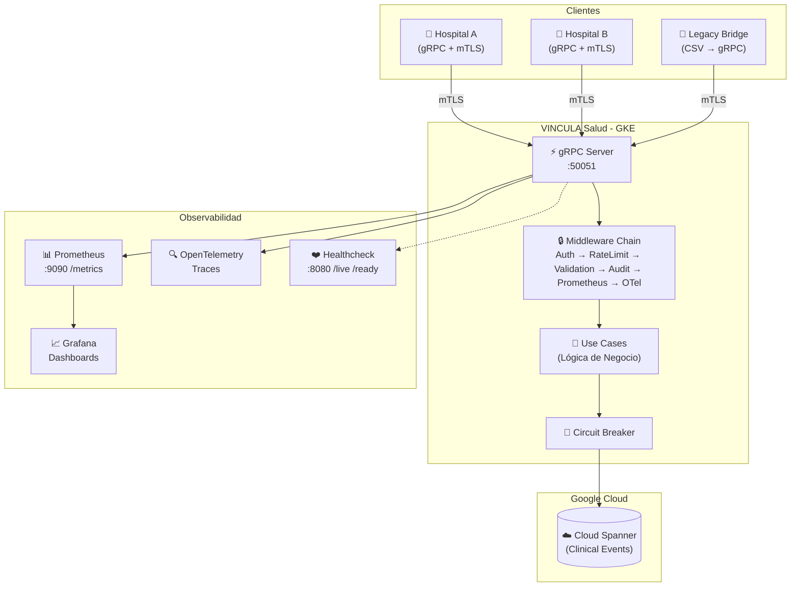

# Arquitectura y Stack Tecnológico

## Arquitectura



### Flujo de datos

1. Un hospital envía una petición gRPC autenticada con **mTLS** (TLS 1.3, certificado de cliente verificado).
2. La petición atraviesa la **cadena de interceptores**: autenticación, rate limiting, validación de campos, auditoría, métricas Prometheus y trazas OpenTelemetry.
3. El **caso de uso** procesa la lógica de negocio y delega la persistencia al repositorio, protegido por un **circuit breaker**.
4. Los datos se persisten en **Cloud Spanner**, que provee consistencia global y alta disponibilidad.
5. Las métricas y trazas se exportan a Prometheus/Grafana y OpenTelemetry respectivamente.

---

## Stack Tecnológico

| Categoría | Tecnología |
|---|---|
| **Lenguaje** | Go 1.25 |
| **Comunicación** | gRPC + Protocol Buffers v3 |
| **Seguridad** | mTLS (TLS 1.3), verificación de certificado de cliente |
| **Base de datos** | Google Cloud Spanner |
| **Resiliencia** | Circuit Breaker (`gobreaker`), Rate Limiting (`x/time/rate`) |
| **Observabilidad** | Prometheus, Grafana, OpenTelemetry (tracing) |
| **Contenedores** | Docker (multi-stage build), Kubernetes (GKE) |
| **CI/CD** | GitHub Actions |
| **IaC** | Terraform, Kustomize (base + overlays) |

---

## Estructura del Proyecto

```
VINCULA Salud/
├── api/v1/                         # Definiciones Protobuf y código generado
│   ├── clinical_record.proto       #   Contrato del servicio gRPC
│   └── clinical/                   #   Código Go generado por protoc
├── cmd/                            # Puntos de entrada (binarios)
│   ├── server/                     #   Servidor gRPC principal
│   ├── healthcheck/                #   Servidor HTTP de health checks (:8080)
│   └── legacy_bridge/              #   Migrador CSV → gRPC de datos legacy
├── internal/                       # Código privado del módulo
│   ├── core/                       #   === Capa de Dominio (Clean Architecture) ===
│   │   ├── domain/                 #     Entidades: ClinicalEvent, PatientSummary
│   │   ├── ports/                  #     Interfaces: Repository, UseCase
│   │   └── usecases/               #     Implementación de la lógica de negocio
│   ├── adapters/                   #   === Capa de Adaptadores ===
│   │   ├── grpc/                   #     Servidor gRPC (ClinicalServer)
│   │   └── storage/                #     Repositorios: Spanner, InMemory, CircuitBreaker
│   ├── middleware/                  #   Interceptores: auth, rate limit, validation, audit
│   └── telemetry/                  #   Inicialización de OTel + métricas custom Prometheus
├── deployments/                    # Infraestructura
│   ├── kubernetes/                 #   Manifiestos K8s (base, overlays, monitoring)
│   ├── terraform/                  #   IaC para GCP
│   ├── deploy.sh                   #   Script de despliegue
│   └── verify.sh                   #   Verificación post-deploy
├── tests/                          # Tests de integración y carga
│   ├── integration/                #   Tests gRPC end-to-end con mTLS
│   └── load/                       #   Tests de carga con k6
├── certs/                          # Certificados mTLS (no versionados)
├── data/                           # Datos de ejemplo (CSV legacy)
├── docs/                           # Documentación adicional
├── .github/workflows/              # Pipelines CI/CD
│   ├── ci.yaml                     #   Lint + Test + Build + Docker en cada PR
│   └── cd.yaml                     #   Deploy automático a GKE
├── Dockerfile                      # Build multi-stage (builder + alpine)
├── Makefile                        # Comandos de desarrollo
├── go.mod / go.sum                 # Dependencias Go
└── .env.example                    # Variables de entorno de ejemplo
```
