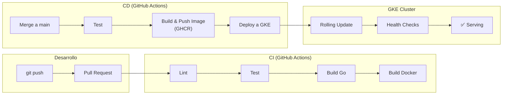

# Guía de Despliegue

Esta guía cubre el proceso completo de despliegue de VINCULA Salud: desde el build de la imagen Docker hasta el deploy en Google Kubernetes Engine (GKE), incluyendo configuración de secretos, certificados y verificación post-deploy.

---

## Tabla de Contenidos

- [Visión General del Pipeline](#visión-general-del-pipeline)
- [Imagen Docker](#imagen-docker)
- [Kubernetes (GKE)](#kubernetes-gke)
- [Configuración de Secretos](#configuración-de-secretos)
- [Certificados mTLS en Producción](#certificados-mtls-en-producción)
- [Proceso de Deploy](#proceso-de-deploy)
- [Verificación Post-Deploy](#verificación-post-deploy)
- [CI/CD con GitHub Actions](#cicd-con-github-actions)
- [Rollback](#rollback)

---

## Visión General del Pipeline



---

## Imagen Docker

### Build Multi-Stage

El `Dockerfile` usa un build de dos etapas para producir una imagen mínima:

```
Etapa 1 (builder):  golang:1.25-alpine
  ├── go mod download (caché de dependencias)
  ├── go build → /bin/clinical-record
  └── go build → /bin/healthcheck

Etapa 2 (runtime):  alpine:3.18
  ├── ca-certificates
  ├── grpc_health_probe
  ├── /usr/local/bin/clinical-record
  └── /usr/local/bin/healthcheck
```

### Build local

```bash
# Build de imagen
docker build -t vincula-salud:latest .

# Run local (requiere montar certs/)
docker run -p 50051:50051 -p 8080:8080 -p 9090:9090 \
  -v $(pwd)/certs:/app/certs \
  -e SPANNER_EMULATOR_HOST=host.docker.internal:9010 \
  vincula-salud:latest
```

### Puertos expuestos

| Puerto | Protocolo | Servicio |
|---|---|---|
| `50051` | gRPC + mTLS | ClinicalRecordService |
| `8080` | HTTP | Health checks (`/live`, `/ready`) |
| `9090` | HTTP | Métricas Prometheus (`/metrics`) |

### Health Check integrado

```dockerfile
HEALTHCHECK --interval=30s --timeout=3s --start-period=10s --retries=3 \
  CMD grpc_health_probe -addr=localhost:50051 || exit 1
```

---

## Kubernetes (GKE)

### Estructura de manifiestos

Los manifiestos usan **Kustomize** para manejar múltiples ambientes:

```
deployments/kubernetes/
├── base/                     ← Configuración base compartida
│   ├── namespace.yaml        ← Namespace: vinca-system
│   ├── deployment.yaml       ← Deployment + HPA
│   ├── service.yaml          ← ClusterIP service
│   ├── configmap.yaml        ← Variables de entorno
│   ├── secret.yaml           ← Placeholder para secretos
│   └── ingress.yaml          ← Ingress con TLS termination
├── overlays/                 ← Overrides por ambiente
│   ├── dev/
│   ├── staging/
│   └── prod/
└── monitoring/               ← Stack de observabilidad
    ├── prometheus.yaml       ← Prometheus + ServiceAccount + RBAC
    └── grafana.yaml          ← Grafana deployment
```

### Deployment

Características clave del Deployment (`base/deployment.yaml`):

| Aspecto | Configuración |
|---|---|
| **Réplicas** | 3 (mínimo), 10 (máximo vía HPA) |
| **Estrategia** | RollingUpdate (`maxSurge: 1`, `maxUnavailable: 0`) |
| **Recursos** | Request: 100m CPU / 256Mi RAM — Limit: 500m CPU / 512Mi RAM |
| **Graceful shutdown** | `terminationGracePeriodSeconds: 60` |
| **Image pull** | `Always` |

### Probes

El pod tiene tres probes configuradas, todas usando `grpc_health_probe`:

```yaml
# Startup Probe — espera hasta 60s (period=2s × failure=30) para que el pod arranque
startupProbe:
  exec:
    command: ["grpc_health_probe", "-addr=:50051"]
  periodSeconds: 2
  failureThreshold: 30

# Liveness Probe — reinicia el pod si no responde
livenessProbe:
  exec:
    command: ["grpc_health_probe", "-addr=:50051"]
  initialDelaySeconds: 15
  periodSeconds: 10
  failureThreshold: 3

# Readiness Probe — remueve del balanceo si no está listo
readinessProbe:
  exec:
    command: ["grpc_health_probe", "-addr=:50051"]
  initialDelaySeconds: 5
  periodSeconds: 5
  failureThreshold: 2
```

### HorizontalPodAutoscaler

```yaml
minReplicas: 3
maxReplicas: 10
metrics:
  - CPU average utilization > 70%
  - Memory average utilization > 80%
```

### Annotations para Prometheus

Los pods se anotan para que Prometheus los descubra automáticamente:

```yaml
annotations:
  prometheus.io/scrape: "true"
  prometheus.io/port: "9090"
  prometheus.io/path: "/metrics"
```

---

## Configuración de Secretos

### Certificados mTLS

Los certificados del servidor se montan como un Kubernetes Secret:

```bash
# Crear el secret con los certificados
kubectl create secret generic vinca-certs \
  --from-file=server.crt=certs/server.crt \
  --from-file=server.key=certs/server.key \
  --from-file=ca.crt=certs/ca.crt \
  -n vinca-system
```

El Deployment los monta en `/app/certs` como volumen de solo lectura:

```yaml
volumeMounts:
  - name: certs
    mountPath: /app/certs
    readOnly: true
volumes:
  - name: certs
    secret:
      secretName: vinca-certs
```

### Variables de entorno

Las variables no sensibles van en el ConfigMap (`configmap.yaml`). Las sensibles deben ir en Secrets de Kubernetes o en un gestor de secretos como Google Secret Manager.

---

## Certificados mTLS en Producción

> **⚠️ CRÍTICO:** No reutilizar los certificados de desarrollo en producción.

Para producción, los certificados deben ser:

1. **Emitidos por una CA interna** del MINSAL o una CA de confianza
2. **Con SANs apropiados** para el dominio del servicio
3. **Rotados periódicamente** (recomendado: cada 90 días)
4. **TLS 1.3 mínimo** (configurado en el servidor con `MinVersion: tls.VersionTLS13`)

### Distribución de certificados de cliente

Cada hospital que se conecte necesita:
- Su propio certificado de cliente firmado por la CA raíz
- La CA raíz (para verificar al servidor)
- El CN del certificado identifica al hospital en los logs de auditoría

---

## Proceso de Deploy

### Deploy automático (recomendado)

El pipeline de CD se ejecuta automáticamente al hacer merge a `main`:

1. **Test** → Ejecuta `make test`
2. **Build** → Construye imagen Docker
3. **Push** → Publica a GitHub Container Registry (`ghcr.io`)
4. **Tags** → `latest` + SHA del commit

### Deploy manual

```bash
# Usando el script provisto
./deployments/deploy.sh <env> <tag>

# Ejemplos:
./deployments/deploy.sh dev latest
./deployments/deploy.sh staging v1.2.3
./deployments/deploy.sh prod v1.2.3
```

El script `deploy.sh` ejecuta:

```bash
# 1. Build de la imagen
docker build -t gcr.io/vincula-salud-$ENV/clinical-record:$TAG .

# 2. Push al registry
docker push gcr.io/vincula-salud-$ENV/clinical-record:$TAG

# 3. Aplicar manifiestos con Kustomize overlay del ambiente
kubectl apply -k deployments/kubernetes/overlays/$ENV

# 4. Esperar rollout
kubectl rollout status deployment/clinical-record-service -n vinca-$ENV
```

### Deploy del stack de monitoring

```bash
# Prometheus + Grafana
kubectl apply -f deployments/kubernetes/monitoring/prometheus.yaml
kubectl apply -f deployments/kubernetes/monitoring/grafana.yaml
```

---

## Verificación Post-Deploy

Usar el script de verificación:

```bash
./deployments/verify.sh <namespace>

# Ejemplo:
./deployments/verify.sh vinca-dev
```

El script verifica:

| Check | Método | Criterio de éxito |
|---|---|---|
| **Pods running** | `kubectl get pods -l app=vinca,component=clinical-record` | Todos en estado `Running` |
| **gRPC health** | `grpc_health_probe -addr=localhost:50051` (exec en pod) | Exit code 0 |
| **Service exposed** | `kubectl get svc clinical-record-service` | Servicio existe y tiene endpoints |

### Verificación manual adicional

```bash
# Ver logs del servidor
kubectl logs -n vinca-dev -l app=vinca,component=clinical-record -f

# Port-forward para acceder localmente
kubectl port-forward -n vinca-dev svc/clinical-record-service 50051:50051

# Verificar métricas Prometheus
kubectl port-forward -n vinca-dev svc/clinical-record-service 9090:9090
curl http://localhost:9090/metrics

# Test funcional con grpcurl
grpcurl -cacert certs/ca.crt \
  -cert certs/client.crt -key certs/client.key \
  -d '{"patient_run":"12345678-9"}' \
  localhost:50051 vinca.clinical.v1.ClinicalRecordService/GetPatientSummary
```

---

## CI/CD con GitHub Actions

### CI Pipeline (`ci.yaml`)

Se ejecuta en **cada Pull Request** a `main`:


### CD Pipeline (`cd.yaml`)

Se ejecuta en **cada push** a `main`:


**Registry:** GitHub Container Registry (`ghcr.io`)

**Tags generados:**
- `ghcr.io/<repo>:latest` — siempre apunta al último build de `main`
- `ghcr.io/<repo>:sha-<full_commit_sha>` — inmutable, trazable

---

## Rollback

### Rollback rápido con kubectl

```bash
# Ver historial de rollouts
kubectl rollout history deployment/clinical-record-service -n vinca-prod

# Rollback a la revisión anterior
kubectl rollout undo deployment/clinical-record-service -n vinca-prod

# Rollback a una revisión específica
kubectl rollout undo deployment/clinical-record-service -n vinca-prod --to-revision=3

# Verificar estado del rollback
kubectl rollout status deployment/clinical-record-service -n vinca-prod
```

### Rollback con imagen específica

```bash
# Forzar una versión específica conocida
kubectl set image deployment/clinical-record-service \
  clinical-record=gcr.io/vincula-salud-prod/clinical-record:v1.1.0 \
  -n vinca-prod
```

### Checklist post-rollback

- [ ] Verificar que todos los pods estén `Running`
- [ ] Ejecutar `./deployments/verify.sh vinca-prod`
- [ ] Verificar métricas en Grafana (no hay spike de errores)
- [ ] Verificar logs de auditoría (no hay errores `AUDIT`)
- [ ] Notificar al equipo en el canal correspondiente
