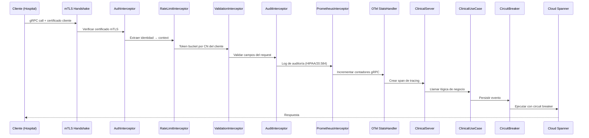

# Guía de Desarrollo

Esta guía cubre todo lo necesario para desarrollar en VINCULA Salud: configuración del entorno, arquitectura interna, convenciones de código, y flujos de trabajo del día a día.

---

## Tabla de Contenidos

- [Configuración del Entorno](#configuración-del-entorno)
- [Arquitectura Interna (Clean Architecture)](#arquitectura-interna-clean-architecture)
- [Flujo de una Petición gRPC](#flujo-de-una-petición-grpc)
- [Cadena de Interceptores (Middleware)](#cadena-de-interceptores-middleware)
- [Protobuf y Generación de Código](#protobuf-y-generación-de-código)
- [Repositorios de Datos](#repositorios-de-datos)
- [Testing](#testing)
- [Convenciones de Código](#convenciones-de-código)
- [Troubleshooting](#troubleshooting)

---

## Configuración del Entorno

### Requisitos

| Herramienta | Versión Mínima | Propósito |
|---|---|---|
| Go | 1.25 | Lenguaje principal |
| protoc | 3.x | Compilador Protocol Buffers |
| gcloud CLI | latest | Emuladores GCP |
| Docker | 20.x | Builds containerizados |
| golangci-lint | latest | Linting |
| k6 | latest | Tests de carga (opcional) |

### Instalación rápida

```bash
# 1. Clonar el repositorio
git clone https://github.com/ciddiazIsaac/Vincula-Salud.git
cd Vincula-Salud

# 2. Instalar dependencias Go y plugins protobuf
make setup

# 3. Configurar variables de entorno
cp .env.example .env
```

### Variables de Entorno

| Variable | Descripción | Valor por defecto |
|---|---|---|
| `GCP_PROJECT_ID` | ID del proyecto en GCP | `vincula-salud-dev` |
| `SPANNER_EMULATOR_HOST` | Host del emulador de Spanner | `localhost:9010` |
| `PUBSUB_EMULATOR_HOST` | Host del emulador de Pub/Sub | `localhost:8085` |
| `SPANNER_DATABASE` | URI completa de la base de datos | `projects/vincula-salud-dev/instances/...` |
| `OTEL_EXPORTER_OTLP_ENDPOINT` | Endpoint para exportar trazas OTel | (deshabilitado si no se configura) |
| `LOG_LEVEL` | Nivel de logging (`debug`, `info`, `warn`, `error`) | `debug` |
| `LEGACY_DB_PATH` | Ruta a datos legacy FoxPro | `./data/legacy_foxpro` |

### Emuladores GCP

Para desarrollo local, el proyecto utiliza emuladores de Google Cloud en lugar de servicios reales:

```bash
# Levantar emuladores de Spanner y Pub/Sub
make emulators-up

# Crear la instancia y base de datos de Spanner en el emulador
make spanner-init
```

> **Nota:** El emulador de Spanner escucha en `:9010` y el de Pub/Sub en `:8085`. Asegúrate de que estos puertos estén libres.

El esquema de la tabla `ClinicalEvents` en Spanner es:

```sql
CREATE TABLE ClinicalEvents (
  PatientRun       STRING(MAX) NOT NULL,
  EventId          STRING(MAX) NOT NULL,
  EventType        STRING(MAX),
  EventDataJson    BYTES(MAX),
  AuthorCredential STRING(MAX),
  RecordedAt       TIMESTAMP,
  EventTimestamp   TIMESTAMP
) PRIMARY KEY(PatientRun, EventId)
```

### Certificados mTLS (Desarrollo)

El servidor requiere certificados TLS mutuos. Para desarrollo local:

```bash
mkdir -p certs

# 1. Generar CA raíz
openssl req -x509 -newkey rsa:4096 -days 365 -nodes \
  -keyout certs/ca.key -out certs/ca.crt \
  -subj "/CN=VINCULA Dev CA"

# 2. Generar certificado del servidor
openssl req -newkey rsa:4096 -nodes \
  -keyout certs/server.key -out certs/server.csr \
  -subj "/CN=localhost"
openssl x509 -req -in certs/server.csr \
  -CA certs/ca.crt -CAkey certs/ca.key \
  -CAcreateserial -out certs/server.crt -days 365

# 3. Generar certificado del cliente
openssl req -newkey rsa:4096 -nodes \
  -keyout certs/client.key -out certs/client.csr \
  -subj "/CN=hospital-dev"
openssl x509 -req -in certs/client.csr \
  -CA certs/ca.crt -CAkey certs/ca.key \
  -CAcreateserial -out certs/client.crt -days 365
```

> **Importante:** Los archivos `*.key`, `*.pem` y `*.cert` están en `.gitignore`. Nunca versionar claves privadas.

---

## Arquitectura Interna (Clean Architecture)

El proyecto sigue **Clean Architecture (Hexagonal)**, separando el dominio de los detalles de infraestructura:

```
internal/
├── core/                     ← Capa de Dominio (sin dependencias externas)
│   ├── domain/               ← Entidades puras
│   │   └── clinical.go       ← ClinicalEvent, PatientSummary
│   ├── ports/                ← Interfaces (contratos)
│   │   ├── repository.go     ← ClinicalRecordRepository
│   │   └── usecase.go        ← ClinicalRecordUseCase
│   └── usecases/             ← Lógica de negocio
│       └── clinical_usecase.go
├── adapters/                 ← Capa de Adaptadores (implementan ports/)
│   ├── grpc/                 ← Adaptador de entrada (servidor gRPC)
│   │   └── clinical_server.go
│   └── storage/              ← Adaptador de salida (repositorios)
│       ├── spanner_repo.go   ← Implementación con Cloud Spanner
│       ├── memory_repo.go    ← Implementación in-memory (para tests)
│       └── cb_repo.go        ← Decorador Circuit Breaker
├── middleware/               ← Interceptores gRPC (cross-cutting)
└── telemetry/                ← Observabilidad (OTel + Prometheus)
```

### Regla de dependencia

```
adapters → core/ports ← core/usecases → core/domain
```

- El **dominio** (`domain/`) no importa nada externo.
- Los **puertos** (`ports/`) definen interfaces puras.
- Los **use cases** implementan los puertos de negocio y dependen solo del dominio.
- Los **adaptadores** implementan los puertos de infraestructura (Spanner, gRPC).

### Entidades de Dominio

```go
// ClinicalEvent representa un evento clínico individual
type ClinicalEvent struct {
    EventID          string    // UUID generado por el use case
    PatientRun       string    // RUN del paciente (ej: "12345678-9")
    EventType        string    // Tipo: allergy, diagnosis, prescription, lab_result, procedure, consultation
    EventDataJSON    []byte    // Datos del evento en JSON
    AuthorCredential string    // Credencial del profesional
    RecordedAt       time.Time // Timestamp de registro en el sistema
    EventTimestamp   time.Time // Timestamp del evento clínico real
}

// PatientSummary es un resumen consolidado del historial del paciente
type PatientSummary struct {
    PatientRun        string
    ActiveAllergies   []string
    ActiveDiagnoses   []string
    ActiveMedications []string
    LastUpdate        time.Time
}
```

---

## Flujo de una Petición gRPC



---

## Cadena de Interceptores (Middleware)

Los interceptores se ejecutan en orden secuencial para cada petición gRPC. El orden es crítico:

### 1. Auth (`middleware/auth.go`)

Extrae la identidad del caller desde el certificado mTLS del cliente:

- **Campos extraídos:** `CommonName`, `DNSNames`, `Organization`, `SerialNumber`
- **Almacenamiento:** Se inyecta `CallerIdentity` al `context.Context`
- **Error:** `codes.Unauthenticated` si no hay certificado o no es TLS

```go
// Recuperar identidad en cualquier handler downstream
identity, ok := middleware.IdentityFromContext(ctx)
```

### 2. Rate Limit (`middleware/ratelimit.go`)

Token bucket por cliente, identificado por el `CommonName` del certificado:

| Parámetro | Valor actual | Descripción |
|---|---|---|
| Rate | 10 req/s | Tokens por segundo |
| Burst | 20 | Capacidad máxima del bucket |

- **Error:** `codes.ResourceExhausted` si se excede el límite
- **Scope:** Per-client (cada CN tiene su propio limiter)

### 3. Validation (`middleware/validation.go`)

Validación estructural de todos los campos del request:

| Campo | Reglas |
|---|---|
| `patient_run` | Obligatorio, formato RUN chileno (`12345678-9` o `12.345.678-K`) |
| `event_type` | Obligatorio, debe ser uno de: `allergy`, `diagnosis`, `prescription`, `lab_result`, `procedure`, `consultation` |
| `event_data_json` | Obligatorio, UTF-8 válido, máximo 1 MB |
| `author_credential` | Obligatorio |
| `page_size` | 0–1000 (default: 100) |

- **Error:** `codes.InvalidArgument` con mensaje descriptivo

### 4. Audit (`middleware/audit.go`)

Log de auditoría inmutable para cumplimiento normativo (Ley 20.584 / HIPAA):

```json
{
  "msg": "AUDIT",
  "caller_cn": "hospital-santiago",
  "caller_org": "MINSAL",
  "method": "/vinca.clinical.v1.ClinicalRecordService/RecordClinicalEvent",
  "patient_run": "12345678-9",
  "result_code": "OK",
  "duration_ms": 23,
  "timestamp_utc": "2026-06-18T22:30:00.000000000Z"
}
```

### 5. Prometheus (`grpc_prometheus`)

Métricas automáticas de gRPC: contadores por método/código, histogramas de latencia.

### 6. OpenTelemetry (`otelgrpc`)

Trazas distribuidas con propagación W3C TraceContext + Baggage.

---

## Protobuf y Generación de Código

### Estructura

```
api/v1/
├── clinical_record.proto      ← Definición del servicio
└── clinical/                  ← Código Go generado
    ├── clinical_record.pb.go
    └── clinical_record_grpc.pb.go
```

### Regenerar código

```bash
# Regenerar código Go desde los .proto
make proto

# Regenerar documentación OpenAPI/Swagger
make swagger
```

### Agregar un nuevo RPC

1. Definir el RPC en `api/v1/clinical_record.proto`
2. Ejecutar `make proto`
3. Implementar el handler en `internal/adapters/grpc/clinical_server.go`
4. Agregar validación en `internal/middleware/validation.go`
5. Si requiere lógica de negocio, agregar al port (`ports/usecase.go`) y al use case
6. Agregar tests unitarios

---

## Repositorios de Datos

El sistema utiliza el patrón **Repository** con tres implementaciones intercambiables:

### SpannerClinicalRepo (`storage/spanner_repo.go`)

- Implementación de producción con Google Cloud Spanner
- Operaciones instrumentadas con OpenTelemetry spans
- Logging estructurado con `slog`

### InMemoryClinicalRepo (`storage/memory_repo.go`)

- Implementación en memoria para tests unitarios y desarrollo rápido
- Thread-safe con `sync.RWMutex`
- No requiere infraestructura externa

### CircuitBreakerRepo (`storage/cb_repo.go`)

- **Decorador** que envuelve cualquier `ClinicalRecordRepository`
- Usa `sony/gobreaker` con la siguiente configuración:

| Parámetro | Valor | Descripción |
|---|---|---|
| `MaxRequests` | 1 | Peticiones permitidas en estado half-open |
| `Timeout` | 10s | Tiempo en estado open antes de pasar a half-open |
| `ReadyToTrip` | 5 fallos consecutivos | Umbral para abrir el circuito |

- **Error:** `codes.Unavailable` cuando el circuito está abierto

---

## Testing

### Tests Unitarios

```bash
# Ejecutar todos los tests con race detector y cobertura
make test

# Ver reporte de cobertura
go tool cover -html=coverage.out
```

Los tests unitarios usan `InMemoryClinicalRepo` para no depender de infraestructura.

Tests existentes:
- `internal/middleware/auth_test.go` — Autenticación mTLS
- `internal/middleware/validation_test.go` — Validación de campos
- `internal/middleware/ratelimit_test.go` — Rate limiting

### Tests de Integración

```bash
# Requiere servidor corriendo con mTLS + emulador Spanner
make test-integration
```

Los tests de integración (`tests/integration/`) usan el build tag `//go:build integration` y se conectan al servidor gRPC real con certificados mTLS.

### Tests de Carga

```bash
# Requiere k6 instalado y servidor corriendo
make load-test
```

Usa k6 con scripts en `tests/load/` para validar rendimiento bajo carga.

---

## Convenciones de Código

### General

- **Idioma del código:** Inglés (nombres de funciones, variables, comentarios técnicos)
- **Idioma del dominio:** Español para términos clínicos chilenos (`patient_run` = RUN del paciente)
- **Logging:** Usar `log/slog` (nunca `fmt.Println` o `log.Fatal` en código de producción)
- **Errores gRPC:** Siempre retornar `status.Error(codes.X, "message")`, nunca errores genéricos de Go
- **Context:** Propagar siempre `context.Context` como primer parámetro

### Estructura de archivos Go

```
paquete/
├── nombre.go          ← Implementación principal
├── nombre_test.go     ← Tests
└── README.md          ← Documentación del paquete (si es complejo)
```

### Linting

```bash
make lint
```

Usa `golangci-lint` con la configuración por defecto. El CI ejecuta lint automáticamente en cada PR.

---

## Troubleshooting

### "No packages found for open file" en VSCode/IDE

Tu IDE no reconoce archivos con build tags custom. Asegúrate de tener en `.vscode/settings.json`:

```json
{
    "gopls": {
        "buildFlags": ["-tags=integration"]
    }
}
```

### "connection refused" al ejecutar `make run`

Verificar que:
1. Los emuladores de GCP estén corriendo (`make emulators-up`)
2. La base de datos esté creada (`make spanner-init`)
3. Los certificados existan en `certs/`

### "certificate signed by unknown authority"

El certificado del cliente no fue firmado por la misma CA que el servidor. Regenerar certificados con los comandos de la sección [Certificados mTLS](#certificados-mtls-desarrollo).

### Emulador de Spanner no arranca

```bash
# Verificar que gcloud SDK tiene el componente beta
gcloud components install beta

# Verificar que el puerto 9010 no está ocupado
lsof -i :9010  # macOS/Linux
netstat -ano | findstr :9010  # Windows
```
