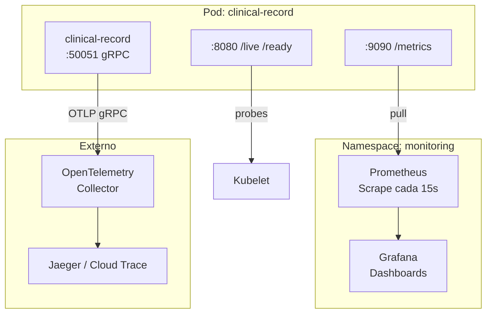
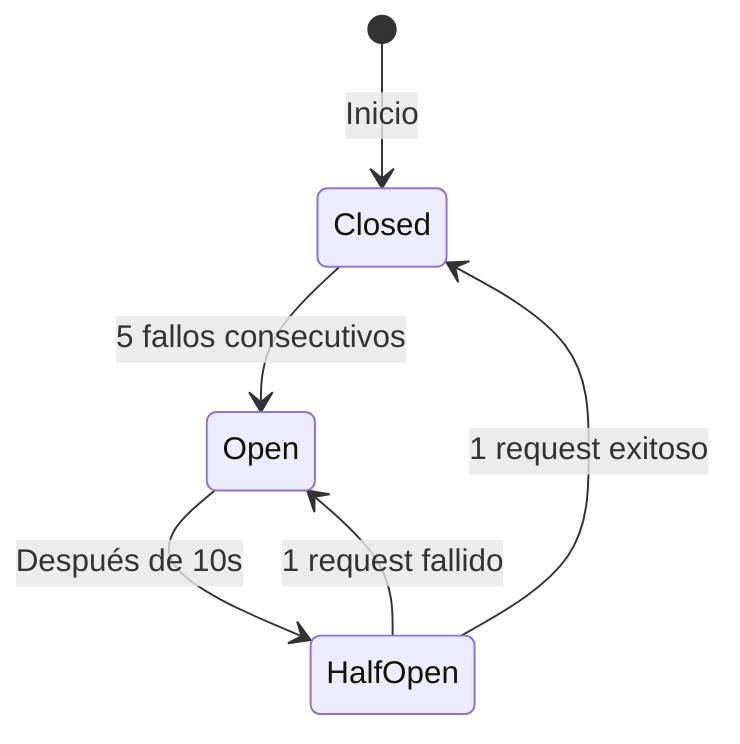

# Guía de Operación

Esta guía está dirigida al equipo SRE/DevOps responsable de operar VINCULA Salud en producción. Cubre observabilidad, alertas, manejo de incidentes, y procedimientos operativos del día a día.

---

## Tabla de Contenidos

- [Arquitectura de Observabilidad](#arquitectura-de-observabilidad)
- [Métricas Prometheus](#métricas-prometheus)
- [Dashboards de Grafana](#dashboards-de-grafana)
- [Trazas Distribuidas (OpenTelemetry)](#trazas-distribuidas-opentelemetry)
- [Logging Estructurado](#logging-estructurado)
- [Alertas Recomendadas](#alertas-recomendadas)
- [Health Checks](#health-checks)
- [Circuit Breaker](#circuit-breaker)
- [Rate Limiting](#rate-limiting)
- [Runbooks Operativos](#runbooks-operativos)
- [Gestión de Certificados mTLS](#gestión-de-certificados-mtls)
- [Escalamiento](#escalamiento)
- [SLOs y SLIs Recomendados](#slos-y-slis-recomendados)

---

## Arquitectura de Observabilidad



### Tres pilares

| Pilar | Herramienta | Endpoint |
|---|---|---|
| **Métricas** | Prometheus + Grafana | `:9090/metrics` |
| **Trazas** | OpenTelemetry → Jaeger/Cloud Trace | OTLP gRPC exporter |
| **Logs** | `slog` JSON → stdout → Cloud Logging | stdout del pod |

---

## Métricas Prometheus

### Métricas de infraestructura gRPC (automáticas)

| Métrica | Tipo | Labels | Descripción |
|---|---|---|---|
| `grpc_server_started_total` | Counter | `grpc_type`, `grpc_service`, `grpc_method` | RPCs iniciados |
| `grpc_server_handled_total` | Counter | `grpc_type`, `grpc_service`, `grpc_method`, `grpc_code` | RPCs completados por código |
| `grpc_server_handling_seconds` | Histogram | `grpc_type`, `grpc_service`, `grpc_method` | Latencia de RPCs |
| `grpc_server_msg_received_total` | Counter | `grpc_type`, `grpc_service`, `grpc_method` | Mensajes recibidos |
| `grpc_server_msg_sent_total` | Counter | `grpc_type`, `grpc_service`, `grpc_method` | Mensajes enviados |

### Métricas custom de negocio

| Métrica | Tipo | Labels | Descripción |
|---|---|---|---|
| `vincula_clinical_events_recorded_total` | Counter | `event_type` | Eventos clínicos registrados exitosamente |
| `vincula_business_errors_total` | Counter | — | Errores de negocio/validación en el handler |

### Queries PromQL útiles

```promql
# Tasa de peticiones por segundo (último 5 min)
rate(grpc_server_handled_total{grpc_service="vinca.clinical.v1.ClinicalRecordService"}[5m])

# Tasa de errores (non-OK)
sum(rate(grpc_server_handled_total{grpc_code!="OK"}[5m]))
/
sum(rate(grpc_server_handled_total[5m]))

# Latencia p99 de RecordClinicalEvent
histogram_quantile(0.99,
  rate(grpc_server_handling_seconds_bucket{grpc_method="RecordClinicalEvent"}[5m])
)

# Latencia p50 general
histogram_quantile(0.50,
  rate(grpc_server_handling_seconds_bucket[5m])
)

# Eventos clínicos por tipo (último 1h)
increase(vincula_clinical_events_recorded_total[1h])

# Tasa de errores de negocio
rate(vincula_business_errors_total[5m])

# Peticiones por hospital (requiere label customización)
sum by (grpc_method)(rate(grpc_server_handled_total[5m]))
```

### Acceso a métricas

```bash
# Local (port-forward)
kubectl port-forward -n vinca-prod svc/clinical-record-service 9090:9090
curl http://localhost:9090/metrics

# Desde Prometheus
kubectl port-forward -n monitoring svc/prometheus 9090:9090
# Abrir http://localhost:9090 en el navegador
```

---

## Dashboards de Grafana

### Dashboard recomendado: Servicio gRPC

| Panel | Query | Tipo |
|---|---|---|
| **Request Rate** | `sum(rate(grpc_server_handled_total[5m]))` | Time series |
| **Error Rate %** | `sum(rate(grpc_server_handled_total{grpc_code!="OK"}[5m])) / sum(rate(grpc_server_handled_total[5m])) * 100` | Gauge |
| **Latencia P50/P95/P99** | `histogram_quantile(0.X, rate(grpc_server_handling_seconds_bucket[5m]))` | Time series |
| **Errores por código** | `sum by (grpc_code)(rate(grpc_server_handled_total{grpc_code!="OK"}[5m]))` | Bar chart |
| **Eventos por tipo** | `sum by (event_type)(increase(vincula_clinical_events_recorded_total[1h]))` | Pie chart |
| **Circuit Breaker** | Count of `codes.Unavailable` errors | Stat |
| **Rate Limit Hits** | Count of `codes.ResourceExhausted` errors | Time series |

### Dashboard recomendado: Infraestructura

| Panel | Query |
|---|---|
| **Pods running** | `kube_deployment_status_replicas_available{deployment="clinical-record-service"}` |
| **CPU usage** | `container_cpu_usage_seconds_total{container="clinical-record"}` |
| **Memory usage** | `container_memory_working_set_bytes{container="clinical-record"}` |
| **Restarts** | `kube_pod_container_status_restarts_total{container="clinical-record"}` |

---

## Trazas Distribuidas (OpenTelemetry)

### Configuración

El servicio exporta trazas vía **OTLP gRPC**. Configurar con variables de entorno:

```bash
# Endpoint del collector (o Jaeger/Cloud Trace)
OTEL_EXPORTER_OTLP_ENDPOINT=http://otel-collector:4317

# Nombre del servicio en las trazas
# (configurado automáticamente como "vincula-salud-clinical")
```

### Spans generados

| Span | Origen | Información |
|---|---|---|
| `grpc.server.*` | `otelgrpc` StatsHandler | Método, código, duración |
| `GetRecentEvents` | `spanner_repo.go` | Patient RUN, límite |
| `SaveEvent` | `spanner_repo.go` | Patient RUN, Event ID |
| `ListEvents` | `spanner_repo.go` | Patient RUN, filtro, límite |

### Correlación logs ↔ trazas

Cada línea de log incluye `trace_id` y `span_id` automáticamente (vía `TraceContextHandler`):

```json
{
  "time": "2026-06-18T22:30:00Z",
  "level": "INFO",
  "msg": "AUDIT",
  "trace_id": "abc123def456...",
  "span_id": "789xyz...",
  "caller_cn": "hospital-santiago",
  "method": "/vinca.clinical.v1.ClinicalRecordService/RecordClinicalEvent"
}
```

Esto permite buscar en Jaeger/Cloud Trace por `trace_id` y ver toda la cadena de spans correlacionada.

---

## Logging Estructurado

### Formato

Todos los logs se emiten en **JSON estructurado** a stdout, usando `log/slog`:

```json
{
  "time": "2026-06-18T22:30:00.000Z",
  "level": "INFO",
  "msg": "AUDIT",
  "trace_id": "...",
  "span_id": "...",
  "caller_cn": "hospital-santiago",
  "caller_org": "MINSAL",
  "method": "/vinca.clinical.v1.ClinicalRecordService/RecordClinicalEvent",
  "patient_run": "12345678-9",
  "result_code": "OK",
  "duration_ms": 23,
  "timestamp_utc": "2026-06-18T22:30:00.000000000Z"
}
```

### Tipos de log

| Prefijo `msg` | Nivel | Descripción |
|---|---|---|
| `AUDIT` | INFO | Registro de auditoría inmutable por cada RPC |
| `Caller authenticated` | DEBUG | Autenticación mTLS exitosa |
| `Authentication failed` | WARN | Certificado rechazado |
| `Request validation failed` | WARN | Campos inválidos |
| `Failed to...` | ERROR | Error de infraestructura |

### Consultas Cloud Logging (GCP)

```
# Todos los logs de auditoría
resource.type="k8s_container"
resource.labels.container_name="clinical-record"
jsonPayload.msg="AUDIT"

# Errores de un paciente específico
jsonPayload.patient_run="12345678-9"
jsonPayload.result_code!="OK"

# Accesos de un hospital
jsonPayload.caller_cn="hospital-santiago"

# Errores del último hora
severity>=ERROR
timestamp>="2026-06-18T21:30:00Z"
```

---

## Alertas Recomendadas

### Alertas críticas (PagerDuty / On-Call)

```yaml
# Alta tasa de errores (>5% durante 5 minutos)
- alert: HighErrorRate
  expr: |
    sum(rate(grpc_server_handled_total{grpc_code!="OK",grpc_service="vinca.clinical.v1.ClinicalRecordService"}[5m]))
    /
    sum(rate(grpc_server_handled_total{grpc_service="vinca.clinical.v1.ClinicalRecordService"}[5m]))
    > 0.05
  for: 5m
  labels:
    severity: critical
  annotations:
    summary: "VINCULA Salud error rate > 5%"

# Latencia P99 alta (>2s durante 5 minutos)
- alert: HighLatencyP99
  expr: |
    histogram_quantile(0.99,
      rate(grpc_server_handling_seconds_bucket{grpc_service="vinca.clinical.v1.ClinicalRecordService"}[5m])
    ) > 2
  for: 5m
  labels:
    severity: critical

# Circuit breaker abierto
- alert: CircuitBreakerOpen
  expr: |
    increase(grpc_server_handled_total{grpc_code="Unavailable"}[5m]) > 10
  for: 2m
  labels:
    severity: critical
  annotations:
    summary: "Circuit breaker está abierto — Spanner posiblemente inaccesible"

# Pods no saludables
- alert: PodsUnhealthy
  expr: |
    kube_deployment_status_replicas_available{deployment="clinical-record-service"}
    < kube_deployment_spec_replicas{deployment="clinical-record-service"}
  for: 5m
  labels:
    severity: critical
```

### Alertas de advertencia

```yaml
# Rate limiting activado
- alert: RateLimitTriggered
  expr: |
    increase(grpc_server_handled_total{grpc_code="ResourceExhausted"}[15m]) > 50
  for: 5m
  labels:
    severity: warning
  annotations:
    summary: "Clientes siendo rate-limited — posible abuso o pico de tráfico"

# Errores de negocio elevados
- alert: HighBusinessErrors
  expr: rate(vincula_business_errors_total[5m]) > 1
  for: 10m
  labels:
    severity: warning

# Uso de memoria alto
- alert: HighMemoryUsage
  expr: |
    container_memory_working_set_bytes{container="clinical-record"}
    / container_spec_memory_limit_bytes{container="clinical-record"}
    > 0.85
  for: 10m
  labels:
    severity: warning
```

---

## Health Checks

### Endpoints

| Endpoint | Protocolo | Propósito | Respuesta OK |
|---|---|---|---|
| `:50051` gRPC Health | gRPC | Health check estándar (K8s probes) | `SERVING` |
| `:8080/live` | HTTP | Liveness — ¿el proceso está vivo? | `{"status":"alive"}` |
| `:8080/ready` | HTTP | Readiness — ¿puede recibir tráfico? | `{"status":"ready"}` |

### Verificación manual

```bash
# gRPC Health Check (dentro del pod)
grpc_health_probe -addr=localhost:50051

# HTTP Health Checks (port-forward)
kubectl port-forward svc/clinical-record-service 8080:8080
curl http://localhost:8080/live
curl http://localhost:8080/ready
```

### Servicios registrados

El servidor registra dos servicios de health:

| Service Name | Descripción |
|---|---|
| `""` (vacío) | Estado general del servidor |
| `clinical-record` | Estado del servicio clínico específico |

### Graceful Shutdown

Cuando el pod recibe `SIGTERM`:

1. Health status cambia a `NOT_SERVING` → K8s deja de enviar tráfico
2. `GracefulStop()` drena conexiones gRPC existentes
3. Servidor de métricas se apaga con timeout de 5s
4. `terminationGracePeriodSeconds: 60` da tiempo para completar requests en vuelo

---

## Circuit Breaker

El circuit breaker protege al servicio contra fallos cascada de Cloud Spanner.

### Estados



### Configuración actual

| Parámetro | Valor |
|---|---|
| **Nombre** | `ClinicalRecordRepo` |
| **Umbral para abrir** | 5 fallos consecutivos |
| **Timeout (open → half-open)** | 10 segundos |
| **Max requests en half-open** | 1 |

### Comportamiento

- **Circuito cerrado:** Todas las peticiones pasan a Spanner normalmente
- **Circuito abierto:** Retorna inmediatamente `codes.Unavailable: "service unavailable due to circuit breaker"` — sin intentar llamar a Spanner
- **Half-open:** Permite 1 petición de prueba; si tiene éxito, cierra el circuito

### Monitoreo

Detectar circuit breaker abierto:

```promql
# Errores Unavailable (señal de circuit breaker abierto)
increase(grpc_server_handled_total{grpc_code="Unavailable"}[5m])
```

---

## Rate Limiting

### Configuración

| Parámetro | Valor | Descripción |
|---|---|---|
| **Algoritmo** | Token Bucket | `golang.org/x/time/rate` |
| **Rate** | 10 tokens/segundo | Reposición constante |
| **Burst** | 20 | Capacidad máxima del bucket |
| **Scope** | Per-client | Identificado por CN del certificado mTLS |

### Comportamiento

- Cada hospital (identificado por el `CommonName` del certificado mTLS) tiene su propio rate limiter
- Si un hospital excede 10 req/s sostenidas (o 20 en ráfaga), recibe `codes.ResourceExhausted`
- Clients sin certificado (anonymous) comparten un limiter global

### Monitoreo

```promql
# Peticiones rechazadas por rate limiting
increase(grpc_server_handled_total{grpc_code="ResourceExhausted"}[5m])
```

### Ajuste

Para modificar los límites, editar `cmd/server/main.go`:

```go
// rate.Limit(10) = 10 tokens/segundo, 20 = burst máximo
rl := middleware.NewRateLimiter(rate.Limit(10), 20)
```

---

## Runbooks Operativos

### 🔴 Alta tasa de errores (>5%)

1. **Verificar logs** → `kubectl logs -l app=vinca,component=clinical-record -n vinca-prod --tail=100`
2. **Verificar Spanner** → ¿Está accesible? ¿Hay errores de cuota? Revisar la consola de GCP
3. **Verificar circuit breaker** → Si hay errores `Unavailable`, el circuit breaker está abierto por problemas de Spanner
4. **Verificar certificados** → Si hay errores `Unauthenticated`, puede ser un certificado expirado
5. **Escalar** si el problema persiste más de 15 minutos

### 🔴 Circuit breaker abierto

1. **Verificar Cloud Spanner** → Estado en consola GCP, cuotas, latencia
2. **Esperar 10s** → El circuit breaker pasa a half-open automáticamente
3. Si el problema persiste:
   - Verificar conectividad de red entre GKE y Spanner
   - Verificar Service Account permissions
   - Considerar rollback si el problema se introdujo con un deploy reciente

### 🟡 Rate limiting activado

1. **Identificar el cliente** → Buscar en logs: `jsonPayload.msg="AUDIT"` con `result_code="ResourceExhausted"`
2. **Evaluar** → ¿Es un pico legítimo o abuso?
3. **Si es legítimo** → Considerar aumentar los límites temporalmente
4. **Si es abuso** → Bloquear el certificado del cliente revocando la CA

### 🟡 Pods reiniciándose

1. **Ver eventos del pod** → `kubectl describe pod <pod-name> -n vinca-prod`
2. **Ver logs previos** → `kubectl logs <pod-name> -n vinca-prod --previous`
3. **Causas comunes:**
   - OOMKilled → Aumentar `resources.limits.memory`
   - Liveness probe failed → Verificar que el servicio responde en `:50051`
   - CrashLoopBackOff → Error de inicialización (certificados faltantes, Spanner inaccesible)

### 🟢 Rotación de certificados

1. Generar nuevos certificados firmados por la CA
2. Actualizar el Secret de Kubernetes:
   ```bash
   kubectl create secret generic vinca-certs \
     --from-file=server.crt=certs/new-server.crt \
     --from-file=server.key=certs/new-server.key \
     --from-file=ca.crt=certs/ca.crt \
     --dry-run=client -o yaml | kubectl apply -f - -n vinca-prod
   ```
3. Hacer rolling restart:
   ```bash
   kubectl rollout restart deployment/clinical-record-service -n vinca-prod
   ```
4. Verificar con `./deployments/verify.sh vinca-prod`

---

## Gestión de Certificados mTLS

### Certificados del servidor

| Archivo | Propósito | Ubicación en pod |
|---|---|---|
| `ca.crt` | CA raíz para verificar clientes | `/app/certs/ca.crt` |
| `server.crt` | Certificado del servidor | `/app/certs/server.crt` |
| `server.key` | Clave privada del servidor | `/app/certs/server.key` |

### Certificados de clientes (hospitales)

Cada hospital tiene su propio par cert/key firmado por la CA raíz. El `CommonName` del certificado identifica al hospital en:
- Logs de auditoría (`caller_cn`)
- Rate limiter (bucket per-client)
- Trazas distribuidas

### Verificar expiración

```bash
# Verificar fecha de expiración del certificado del servidor
openssl x509 -enddate -noout -in certs/server.crt

# Verificar un certificado de cliente
openssl x509 -enddate -noout -in certs/client.crt

# Ver toda la información del certificado
openssl x509 -text -noout -in certs/server.crt
```

---

## Escalamiento

### Horizontal (HPA)

El HPA escala entre 3 y 10 réplicas basado en CPU y memoria:

```bash
# Ver estado actual del HPA
kubectl get hpa clinical-record-hpa -n vinca-prod

# Ajustar límites manualmente (temporal)
kubectl patch hpa clinical-record-hpa -n vinca-prod \
  -p '{"spec":{"maxReplicas":15}}'
```

### Vertical

Si el HPA alcanza el máximo de réplicas y la latencia sigue alta:

1. Aumentar `resources.limits` en el Deployment
2. Evaluar si Spanner necesita más nodos
3. Considerar optimizar queries o agregar caching

---

## SLOs y SLIs Recomendados

### SLIs (Service Level Indicators)

| SLI | Query PromQL |
|---|---|
| **Disponibilidad** | `sum(rate(grpc_server_handled_total{grpc_code="OK"}[30d])) / sum(rate(grpc_server_handled_total[30d]))` |
| **Latencia P99** | `histogram_quantile(0.99, rate(grpc_server_handling_seconds_bucket[5m]))` |
| **Error Rate** | `sum(rate(grpc_server_handled_total{grpc_code!="OK"}[5m])) / sum(rate(grpc_server_handled_total[5m]))` |

### SLOs recomendados (piloto)

| SLO | Objetivo | Ventana |
|---|---|---|
| **Disponibilidad** | ≥ 99.5% | 30 días |
| **Latencia P99** | ≤ 2 segundos | Rolling 5 min |
| **Error Rate** | ≤ 1% | Rolling 5 min |

> **Nota:** Estos SLOs son para la fase piloto. Ajustar según la carga real y los requerimientos del MINSAL antes de pasar a producción.

### Error Budget

Con 99.5% de disponibilidad en 30 días:
- **Error budget** = 0.5% × 30 días × 24h × 60min = **216 minutos** de downtime permitido al mes
- Usar como criterio para decidir si hacer deploys arriesgados o freeze
